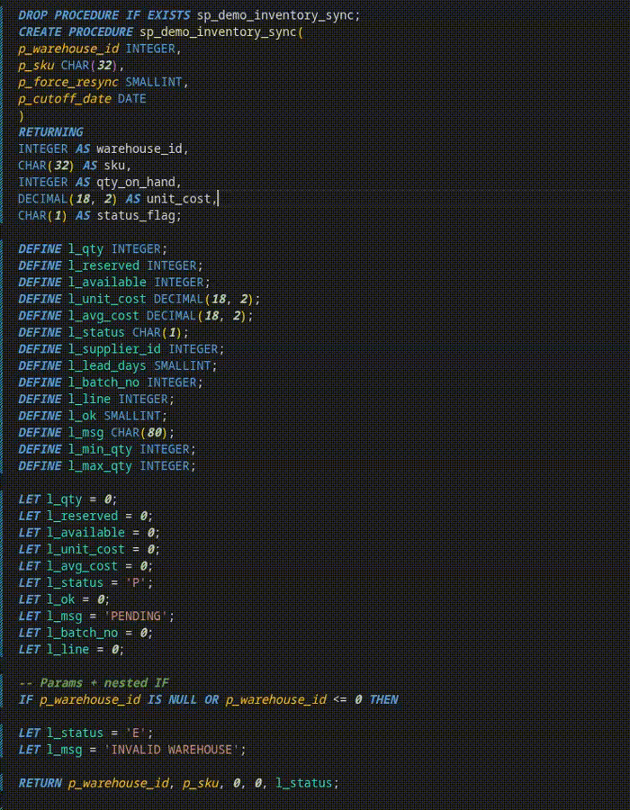
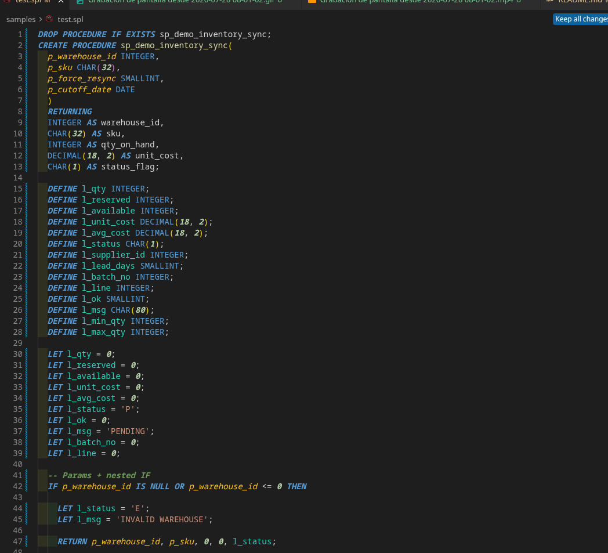
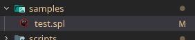

# IFX Format

[Español](README.md) · [English](README.en.md)

Formatea procedimientos **Informix SPL** en Cursor y VS Code, sin pisar formatters de SQL genérico (Postgres, etc.).

**ID:** `emanuelmanga.ifx-format`



## Características

- Formato de `DEFINE`, `LET`, `IF` / `ELSE` / `END IF`, `FOR` / `FOREACH`, queries y subqueries
- Keywords a mayúsculas (configurable)
- Indentación y líneas en blanco ajustables
- Syntax highlight TextMate para Informix SPL
- Colorea parámetros del `CREATE PROCEDURE` y variables `DEFINE` en todo el archivo
- Language ID propio (`informix-spl`): no interfiere con `.sql` de Postgres u otros
- Icono propio para archivos `.ifs` / `.ifx` / `.spl`

## Preview

### Highlight de parámetros y variables

Parámetros del procedure y variables `DEFINE` con colores distintos:



### Icono de archivo `.spl`



## Archivos soportados

| Extensión | Language ID | Formatter |
| --- | --- | --- |
| `.ifs`, `.ifx`, `.spl` | `informix-spl` | IFX Format |
| `.sql` | `sql` | Tus formatters habituales |

Para proyectos solo Informix, asociá `.sql` en el workspace:

```json
{
  "files.associations": {
    "*.sql": "informix-spl"
  }
}
```

## Uso

1. Abrí un `.ifs`, `.ifx` o `.spl`
2. **Format Document** (`Shift+Alt+F`) o activá format on save
3. O el comando **IFX Format: Format Document**

Al instalar, `informix-spl` ya viene con IFX Format como formatter por defecto y format on save.

## Ejemplo

**Antes**

```sql
create procedure sp_demo(p_id int)
returning int;
define l_total int;
if p_id > 0 then
let l_total = p_id * 2;
else
let l_total = 0;
end if;
return l_total;
end procedure;
```

**Después**

```sql
CREATE PROCEDURE sp_demo(p_id INT)
RETURNING INT;

  DEFINE l_total INT;

  IF p_id > 0 THEN
    LET l_total = p_id * 2;
  ELSE
    LET l_total = 0;
  END IF;

  RETURN l_total;

END PROCEDURE;
```

## Settings

### Formato

| Setting | Default | Descripción |
| --- | --- | --- |
| `ifxFormat.uppercase` | `true` | Keywords en mayúsculas |
| `ifxFormat.indentSize` | `2` | Espacios por nivel |
| `ifxFormat.useTabs` | `false` | Tabs en vez de espacios |
| `ifxFormat.blankAfterQuery` | `true` | Línea en blanco tras queries |
| `ifxFormat.blankAfterIf` | `true` | Línea en blanco tras `IF` / `ELSE` / `END IF` |
| `ifxFormat.blankAfterReturning` | `true` | Línea en blanco tras `RETURNING` |
| `ifxFormat.blankBeforeElseEndIf` | `true` | Línea en blanco antes de `ELSE` / `END IF` |
| `ifxFormat.keepEndClosersTogether` | `true` | Cierres consecutivos sin blancos entre sí |

### Highlight de variables

| Setting | Default | Descripción |
| --- | --- | --- |
| `ifxFormat.syntax.highlightVariables` | `true` | Colorea parámetros y variables |
| `ifxFormat.syntax.parameterColor` | `#FBBF24` | Color de parámetros |
| `ifxFormat.syntax.localColor` | `#2DD4BF` | Color de variables locales |

## Requisitos

Cursor o VS Code `>= 1.74`

## Links

- [Repositorio](https://github.com/EmanuelManga/ifx-format)
- [Issues](https://github.com/EmanuelManga/ifx-format/issues)

## Licencia

MIT
